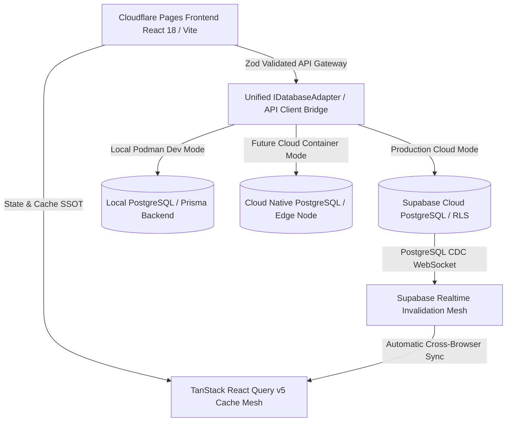

# SP-PLASTECH ERP — Enterprise 16-Module Migration & Architecture Blueprint

> **Target Architecture**: Hybrid Multi-Tenant Monorepo  
> **Frontend**: React 18+ / Vite / TypeScript / TailwindCSS deployed on **Cloudflare Pages & Edge Workers**  
> **Backend Service**: Node.js / Prisma & Next.js BFF deployed in **Local Podman** (Seamlessly hostable to Cloud Containers)  
> **Database Layer**: PostgreSQL via **Supabase Cloud / Kong Gateway** (Multi-Tenant RLS Enabled)  
> **State & Cache Management**: **TanStack Query (React Query) v5** Single Source of Truth (SSOT)  
> **Contract Validation**: **Zod Schemas** for all API inputs, outputs, and form submissions  

---

## 1. Executive Architectural Principles & Non-Negotiable Standards



### The 7 Strict Enterprise Rules
1. **Zero Raw Fetches**: Never use `useEffect` + `fetch`/`axios` for UI data fetching. Every data access MUST use `useQuery` or `useMutation` via TanStack Query v5.
2. **Mandatory Pagination**: No unpaginated `SELECT *` or full-table dumps. All catalog, transaction, and ledger grids MUST use cursor-based or offset pagination (`LIMIT` + `offset`/`cursor`).
3. **Single Source of Truth (SSOT)**: `localStorage` and `sessionStorage` are strictly forbidden for business domain entities. The TanStack Query cache is the only source of truth.
4. **End-to-End Type Safety**: Every network payload MUST pass through strict `zod` schema parsers before reaching UI components.
5. **Multi-Tenant Isolation**: Every database operation MUST enforce `tenant_id` filtering at the database (RLS) and query gateway layers.
6. **Cloudflare Cache Governance**: All dynamic API routes MUST deliver headers: `Cache-Control: no-store, no-cache, must-revalidate, proxy-revalidate`.
7. **Deterministic Mutation Invalidation**: All mutations MUST trigger `queryClient.invalidateQueries()` with targeted query keys to guarantee instantaneous, cross-browser synchronization.

---

## 2. Pluggable Hybrid Provider Adapter Pattern

To ensure the ERP is completely **vendor-agnostic** (swappable between Cloudflare, Supabase, Podman, and AWS/GCP without code rewriting), all database and API communication flows through a unified adapter interface:

```typescript
// src/shared/db/types.ts
export interface IDatabaseAdapter {
  providerName: 'hybrid_sync' | 'supabase' | 'rest_api' | 'offline_db';
  findMany<T>(table: string, filter?: QueryFilter): Promise<T[]>;
  findOne<T>(table: string, idOrKey: string, keyField?: string): Promise<T | null>;
  upsert<T>(table: string, payload: Partial<T>): Promise<T>;
  delete(table: string, idOrKey: string, keyField?: string): Promise<boolean>;
  count(table: string, filter?: QueryFilter): Promise<number>;
}
```

---

## 3. Enterprise Error Handling & Diagnostic Architecture

```
[UI Layer / Form / Action]
        │
        ▼
[Zod Schema Validation Guard] ──(Fail)──► [User-Friendly Toast & Field Highlight]
        │ (Pass)
        ▼
[TanStack Query Mutation / Query]
        │
        ▼
[Centralized Error Interceptor]
        │
        ├── (400 Bad Request / Schema Mismatch) ──► Log structured error to Console & Audit Log
        ├── (401 / 403 Forbidden) ────────────────► Trigger Session Refresh or MFA Modal
        ├── (429 Rate Limit / 503 Outage) ────────► Exponential Backoff Retry (Max 3 attempts)
        └── (Network Failure) ────────────────────► Graceful UI Fallback (No screen blanking)
```

1. **Error Boundaries**: Every ERP module is wrapped in an isolated `<ErrorBoundary>` to prevent single-component errors from crashing the application shell.
2. **Sanitized Diagnostics**: Stack traces and raw database internals are intercepted and logged in structured telemetry format without exposing credentials in client logs.
3. **Empty vs Loading Separation**: Explicit skeleton loading states render during network in-flight states, eliminating interim "Empty Catalog" flashes.

---

## 4. Discrete 16-Module Migration Roadmap

The migration is divided into **6 sequential, independent phases**:

| Phase | Target Modules | Primary Deliverables | Verification Gateway |
| :--- | :--- | :--- | :--- |
| **Phase 1** | **Master Data & Engineering** (Modules 1–2) | Item Master, Tooling Specs, Multi-Level BOMs, Recipe Scaler, ECO/ECR. | Playwright Item Master CRUD & BOM Explosion Suite |
| **Phase 2** | **Manufacturing & Quality** (Modules 3, 7, 9) | Planning Board, Work Orders, Daily Production Entry, QC Inspections, NCR, CAPA, COA, Machine Maintenance. | Shopfloor Entry & Inspection Gate Playwright Suite |
| **Phase 3** | **Procurement & Warehouse** (Modules 4–5) | Purchase Requisitions, POs, Vendor Pricing, 2D Bin Maps, Putaway, Lot/Batch Traceability. | Stock Ledger & PO Lifecycle Playwright Suite |
| **Phase 4** | **Sales, CRM & SCM** (Modules 6, 11, 12) | Quotations, Sales Orders, Costing Modeler, Delivery Challans, Material Requirements Planning (MRP). | Sales-to-MRP Order Flow Playwright Suite |
| **Phase 5** | **Finance & General Ledger** (Module 8) | Chart of Accounts, Journal Entries, AR/AP Aging, GST/Tax Engine, Financial Statements. | Balanced Ledger & Transaction Consistency Tests |
| **Phase 6** | **Workforce, Admin & Analytics** (Modules 10, 13, 14, 15, 16) | HR Rosters, Executive Analytics, RBAC Matrix, Security Audit Trail, Integration Gateway, Approvals Hub. | Global Navigation Crawler & RBAC Security Suite |

---

## 5. Detailed Module-by-Module Specification

### Module 1: Master Data (Item Master & Mold/Tooling Master)
- **Tables**: `items`, `mold_tools`, `warehouses`, `plants`
- **SSOT Hook**: `usePaginatedItems({ page, limit, search, category, status })`
- **Mutations**: `useSaveItem()`, `useDeleteItem()`, `useBulkImportItems()`
- **Schema**: `ItemMasterSchema` with injection molding attributes (cavity count, cycle time seconds, part weight, runner weight, shot weight, resin type).

### Module 2: Engineering & BOM (Formula & Routing Hub)
- **Tables**: `boms`, `bom_items`, `routing_operations`, `eco_orders`, `ecr_requests`
- **SSOT Hook**: `useBoms()`, `useBomDetail(id)`
- **Calculations**: Real-time recipe scaling, scrap allowance percentage, and machine hourly rate costing rollup.

### Module 3: Manufacturing Command Center & Shopfloor
- **Tables**: `work_orders`, `machines`, `production_entries`, `downtime_logs`
- **SSOT Hook**: `useWorkOrders({ status, machineId, shift })`
- **Calculations**: Real-time OEE (Availability × Performance × Quality), hourly shot output, regrind (RG) material mixing ratio.

### Module 4: Procurement & Vendor Management
- **Tables**: `purchase_orders`, `purchase_requisitions`, `suppliers`, `supplier_price_lists`
- **SSOT Hook**: `usePurchaseOrders()`, `useSuppliers()`
- **Governance**: Auto-generation of PO numbers, supplier lead time tracking, and multi-tier approval thresholds.

### Module 5: Warehouse & Inventory Intelligence
- **Tables**: `warehouse_bins`, `stock_transactions`, `lot_batches`, `rmas`
- **SSOT Hook**: `useStockLedger()`, `useWarehouseBins(warehouseId)`
- **Features**: Visual 2D bin coordinate mapping, FEFO (First-Expired-First-Out) picking, and quarantine hold gates.

### Module 6: Commercial & Sales Order Register
- **Tables**: `sales_orders`, `sales_order_lines`, `monthly_plan_orders`, `dispatch_documents`
- **SSOT Hook**: `useSalesOrders()`, `useCustomerOrders(customerCode)`
- **Calculations**: Tax breakdown (CGST, SGST, IGST), freight and packaging value rollup, delivery challan reconciliation.

### Module 7: Quality Intelligence (QC, NCR, CAPA, COA)
- **Tables**: `qc_inspections`, `quality_ncrs`, `quality_capas`, `quality_coas`
- **SSOT Hook**: `useQualityInspections()`, `useNcrs()`, `useCapas()`
- **Governance**: 8D root-cause problem solving workflows and electronic Certificate of Analysis signing.

### Module 8: Financial Command Center & General Ledger
- **Tables**: `accounts`, `journal_entries`, `tax_invoices`, `fixed_assets`
- **SSOT Hook**: `useChartOfAccounts()`, `useJournalEntries()`
- **Integrity**: Double-entry bookkeeping balance validation (Debits = Credits) prior to mutation persistence.

### Module 9: MEP & Plant Equipment Maintenance
- **Tables**: `machines`, `maintenance_schedules`, `breakdown_tickets`
- **SSOT Hook**: `useMachineMaintenance()`, `useBreakdownTickets()`
- **Automation**: Preventive maintenance scheduling based on machine shot cycle counters.

### Module 10: Human Capital & Workforce Management
- **Tables**: `employees`, `shift_rosters`, `operator_skills`
- **SSOT Hook**: `useShiftRosters()`, `useOperatorSkills()`
- **Compliance**: Plant attendance logging and skill-matrix machine assignment validation.

### Module 11: Supply Chain & Material Requirements Planning (MRP)
- **Tables**: `mrp_runs`, `material_shortages`, `demand_forecasts`
- **SSOT Hook**: `useMrpCalculations()`
- **Engine**: Backward scheduling from sales order delivery dates to trigger procurement purchase requisitions.

### Module 12: CRM, Costing Modeler & Client Trials
- **Tables**: `crm_inquiries`, `crm_quotations`, `sample_trials`, `customers`
- **SSOT Hook**: `useCrmInquiries()`, `useQuotations()`
- **Tooling**: Parametric piece-part costing modeler with tool amortization and profit margin sliders.

### Module 13: Executive Analytics & Yield Intelligence
- **Tables**: Aggregated analytical RPCs (`get_plant_analytics`, `get_oee_metrics`)
- **SSOT Hook**: `useExecutiveAnalytics()`
- **Visuals**: Pareto scrap charts, machine capacity heatmaps, and financial realization trends.

### Module 14: System Administration, RBAC & Audit Trails
- **Tables**: `users`, `profiles`, `auth_roles`, `audit_logs`, `company_settings`
- **SSOT Hook**: `useAuditLogs()`, `useUserDirectory()`
- **Security**: Granular RBAC permissions (`create_item`, `approve_item`, `delete_item`), session inactivity timers, and immutable audit logs.

### Module 15: Integration Hub, Webhooks & IoT Gateways
- **Tables**: `integrations`, `webhook_subscriptions`, `api_keys`
- **SSOT Hook**: `useIntegrations()`
- **Connectivity**: Third-party ERP connectors (SAP, Tally), weighing scale serial interfaces, and PLC OPC-UA gateways.

### Module 16: Workspace Hub & Centralized Approvals Hub
- **Tables**: `master_data_change_requests`, `workflow_approvals`, `user_notifications`
- **SSOT Hook**: `useApprovalsQueue()`, `useNotifications()`
- **Productivity**: Unified cross-module approval queue (Master Data, Purchase Orders, Engineering ECOs, and Credit Limits).

---

## 6. Verification, Testing & Production Release Standard

Every single module migration step must meet the following mandatory release gates:
1. **0 TypeScript Diagnostics**: `tsc --noEmit` must pass with 0 errors.
2. **Automated E2E Coverage**: Playwright test suite must pass with 100% green assertions for Create, Read, Update, Delete.
3. **Single API Call Verification**: Network monitor asserts exactly 1 request per CRUD action.
4. **Cloudflare Production Build**: `npm run build` generates optimized bundle without breaking asset size limits.
5. **No Regression**: All previously completed modules remain 100% stable.
