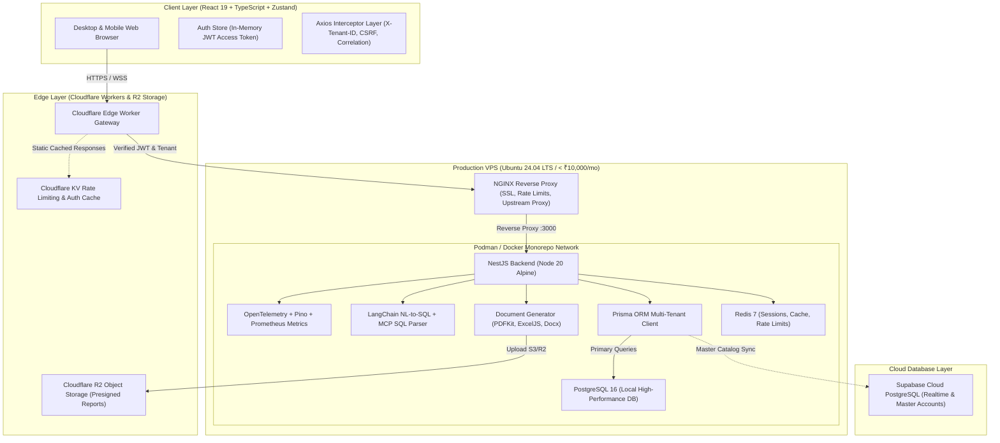

# SP-PLASTECH ERP: Hybrid Monorepo Production Runbook & Architecture Specification

---

## 1. System Architecture Diagram



---

## 2. Multi-Tenancy & Financial Precision Rules

1. **Decimal Precision**: All currency, material weights (kg, g), cycle times (s), and scrap rates are computed using `Decimal.js` (or Prisma `Decimal(18,4)`), never IEEE-754 floating point numbers.
2. **Tenant Isolation**: Every database table contains a mandatory `tenantId` column with composite index `[tenantId, id]`. Queries enforce tenant filters at three distinct layers:
   - Cloudflare Worker Gateway (`X-Tenant-ID` header validation)
   - NestJS `TenantGuard` via `AsyncLocalStorage`
   - Prisma Extension / Base Repository filter injection
3. **Audit Snapshotting**: All mutations (`CREATE`, `UPDATE`, `DELETE`) automatically write JSON delta diffs to `AuditLog` and increment `EntityVersion`.

---

## 3. AI & Safe SQL Execution Engine

1. **AST Blocklist**: Any SQL query emitted by the AI chain is parsed against an AST syntax validator:
   - Prohibits: `DROP`, `DELETE`, `TRUNCATE`, `ALTER`, `INSERT`, `UPDATE`, `GRANT`, `REVOKE`, `EXEC`.
   - Prohibits accessing internal tables: `_prisma_migrations`, `User`, `Role`, `Tenant`.
2. **Enforced Tenant Scope**: The SQL parser automatically injects or verifies `WHERE tenantId = :activeTenantId` on all table targets.
3. **Reporting Pipeline**: If the query requests tabular analytics, `DocumentGeneratorService` streams PDFKit (PDF), ExcelJS (XLSX), or DOCX to Cloudflare R2 and returns a presigned download URL.

---

## 4. Production Deployment & Operations (< ₹10,000 / month VPS)

### Hardware Requirements
- **VPS Specs**: 4 vCPU, 8 GB RAM, 100 GB NVMe SSD (e.g. Hetzner CPX31 / DigitalOcean Droplet / Hostinger KVM 4).
- **OS**: Ubuntu 22.04 / 24.04 LTS.

### Quick Start Deployment

1. **Clone Repository & Set Environment Variables**:
   ```bash
   git clone https://github.com/datastock2025-prog/SP-PLASTECH.git /opt/sp-plastech
   cd /opt/sp-plastech
   cp .env.example .env
   # Edit .env with your secrets (DATABASE_URL, JWT_SECRET, R2 credentials)
   ```

2. **Launch Podman / Docker Compose**:
   ```bash
   docker compose -f docker-compose.yml up -d --build
   ```

3. **Run Prisma Migrations & Seeding**:
   ```bash
   docker compose exec backend npx prisma migrate deploy
   docker compose exec backend npx prisma db seed
   ```

4. **Configure NGINX & SSL**:
   ```bash
   sudo cp infrastructure/nginx/sp-plastech.conf /etc/nginx/sites-available/
   sudo ln -s /etc/nginx/sites-available/sp-plastech.conf /etc/nginx/sites-enabled/
   sudo certbot --nginx -d erp.sp-plastech.com
   sudo systemctl reload nginx
   ```

5. **Deploy Cloudflare Edge Worker**:
   ```bash
   cd infrastructure/cloudflare
   npx wrangler deploy
   ```

---

## 5. Observability & Health Checking

- **Health Check Endpoint**: `GET http://localhost:3000/health` (Reports NestJS status, DB connection, Redis memory).
- **Prometheus Metrics**: `GET http://localhost:3000/metrics`
- **Audit Logs View**: Accessible in Admin Panel or querying `SELECT * FROM "AuditLog" ORDER BY "createdAt" DESC LIMIT 50;`.
